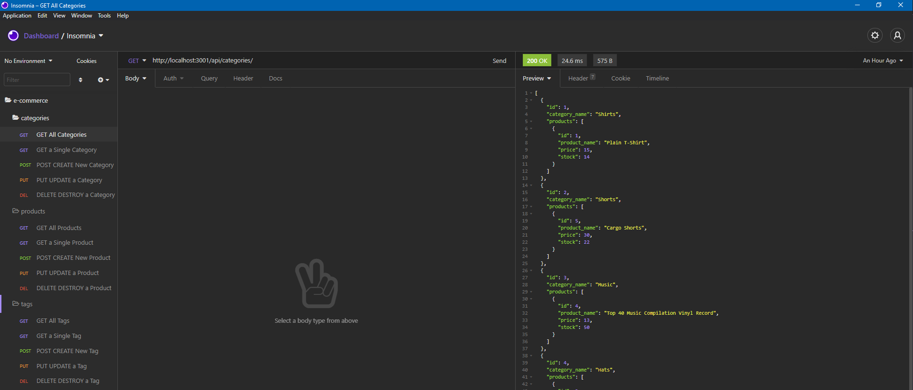

# E-Commerce (Back-End)
## Description
This is the back-end programming for a e-commerce application environment. There is no front-end code nor a deployed site as this is only the database and routes logic. See the [Installation](#installation) and [Usage](#usage) sections to see how to install and use this application locally. 

## Table of Contents
* [Usage](#usage)
* [Questions](#questions)

      
* [Installation](#installation)
        
* [Credits](#credits)
        
* [License](#license)
        
* [Features](#features)
        
* [Contributing](#contributing)
        
* [Tests](#tests)
        
    
  

## Installation
This is a `node` based application. To use this application, you must clone it locally to your machine and have node installed to use it. See [Credits](#credits) for more information.    Follow these steps to install this application locally:  1: Clone the repository locally to your machine. 2: In the terminal, run `npm i` to install the required dependencies (see Credits for more information on these).  3: This application requires a `.env` file to be created with credentials to access a MySQL server. (see [Credits](#credits) for a link to set up a MySQL account). After creating the `.env` file add the following code to it:  `DB_NAME='ecommerce_db'`  `DB_USER='root'` (this may also need to be your MySQL username)  `DB_PW='PASSWORD'` (where PASSWORD is your MySQL password)  4: Seed the database by running `npm run seed` in the terminal.  5: Test the server my running `npm start` in the terminal and look for the "App listening on port 3001!" log in the console. Troubleshoot any errors via the MySQL documentation.   The application is now installed locally on your machine. See [Usage](#usage) for instructions on how to use this application.   [Installation Walk Through Video Link](https://drive.google.com/file/d/1XsjCERkdHQk65ae5FKsQeTUdslh8nCY8/view)
    
## Usage
Please see the [Installation](#installation) section to install this application before use.   Here is how to use this application:   In the terminal, run `npm start` to start the express server.   Visit http://localhost:3001/api/categories to make your first api call (you may also visit this url via Insomnia if installed, see [Credits](#credits) for more information.   See [Features](#features) for a full list of api endpoints.   To re-seed the database, in the terminal run `npm run seed` to use the provided seed data for the database. Consider this the ultimate 'reset' for the live database.    See the below videos for demonstration on the different API Route Endpoints seen via Insomnia
  [Installation Walk Through Video Link](https://drive.google.com/file/d/1XsjCERkdHQk65ae5FKsQeTUdslh8nCY8/view)

### Screenshot

## Credits
THIRD-PARTY ASSETS Starter code provided by https://github.com/coding-boot-camp/fantastic-umbrella    RESOURCES   [Node.js](https://nodejs.org/en/)   [dotenv](https://www.npmjs.com/package/dotenv)   [Express.js](https://expressjs.com/)   [MySQL2](https://www.npmjs.com/package/mysql2)   [Sequelize](https://www.npmjs.com/package/sequelize)   [Insomnia](https://insomnia.rest/)
    

## License

    

## Features
Here are all the available API Route Endpoints:

CATEGORIES 
 http://localhost:3001/api/categories  
 http://localhost:3001/api/categories/`id number here`   
 http://localhost:3001/api/categories  
`You must use an environment like Insomnia to POST to the database. It is expecting a JSON body object with category_name`.    
 http://localhost:3001/api/categories/`id number here`  
`You must use an environment like Insomnia to PUT to the database. It is expecting a JSON body object with category_name to update`.   
 http://localhost:3001/api/categories/`id number here` 

PRODUCTS   
 http://localhost:3001/api/procuts   
 http://localhost:3001/api/products/`id number here`   
 http://localhost:3001/api/products  
`You must use an environment like Insomnia to POST to the database. It is expecting a JSON body object with product_name, price, stock, and category_id`.    
 http://localhost:3001/api/products/`id number here`  
`You must use an environment like Insomnia to PUT to the database. It is expecting a JSON body object with updated parameters. The tagIds should be an array of the numbers referring to the appropriate tags`.   
 http://localhost:3001/api/categories/`id number here`

TAGS   
 http://localhost:3001/api/tags   
 http://localhost:3001/api/tags/`id number here`   
 http://localhost:3001/api/tags  
`You must use an environment like Insomnia to POST to the database. It is expecting a JSON body object with tag_name`.    
 http://localhost:3001/api/tags/`id number here`  
`You must use an environment like Insomnia to PUT to the database. It is expecting a JSON body object with tag_name to update`.    
 http://localhost:3001/api/tags/`id number here` 
    

## Contributing
This application is not open to outside contribution.

## Tests
There are no tests for this application.
    
## Questions
For all questions regarding this project, feel free to contact me at:

GitHub: [SirUbu](https://github.com/SirUbu)

Email: thesirubu@gmail.com
